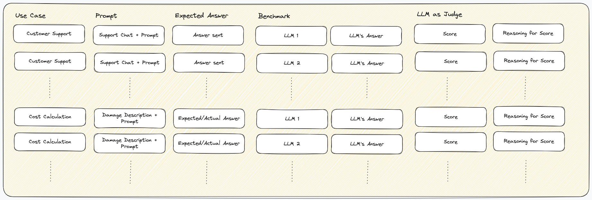
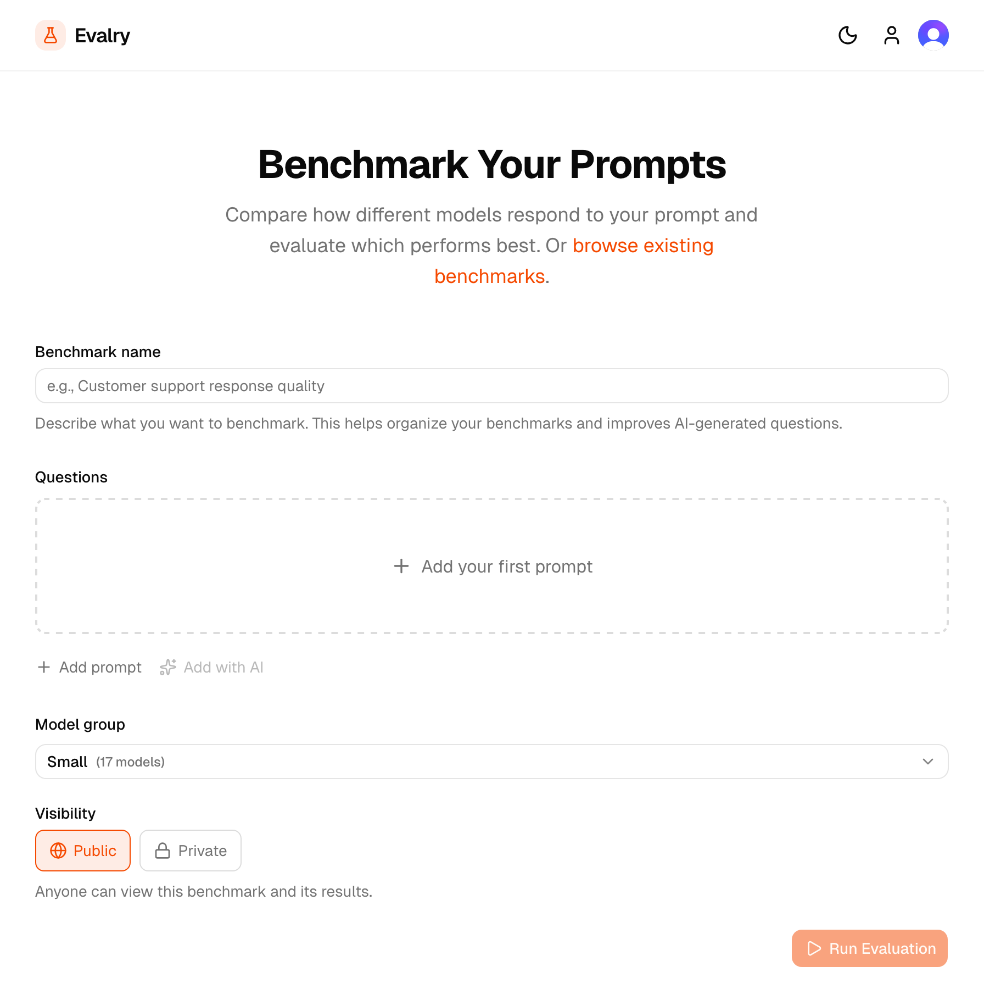
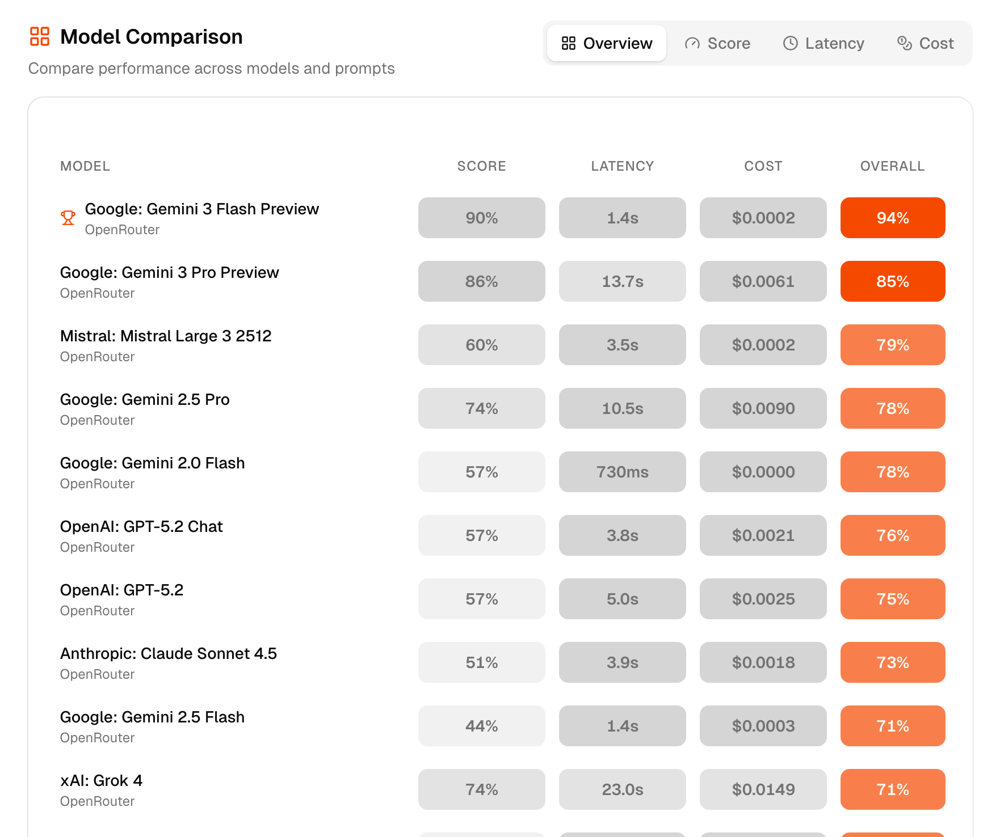

Last month I helped a friend cut his LLM API bill by 80%.

He's a non-technical founder building an AI-powered business.
Like most people, he picked GPT-5 because it's the default:
You have the API already,
it has solid benchmarks,
everyone uses it,
why bother?!

But as usage grew, so did his bill.
$1,500/month for API calls alone.

So we benchmarked his actual prompts against 100+ models
and quickly realized that while GPT-5 is a solid choice,
it almost never is the cheapest and there are always cheaper options
with comparable quality.
Figuring out which saved him thousands of dollars in the process.
Here's how we did it.

Discuss: [HN](https://news.ycombinator.com/item?id=46696300) | [X](https://x.com/karllorey/status/2013691168027038056)

## The Problem: Benchmarks don't predict performance on your task

When picking an LLM, most people just choose a model from their favorite provider.
For me, that's Anthropic, so depending on the task, I pick Opus, Sonnet, or Haiku.
If you're sophisticated, you might check Artificial Analysis, or LM Arena,
or whatever benchmark seems relevant:
GPQA Diamond, AIME, SWE Bench, MATH 500, Humanity's Last Exam, ARC-AGI, MMLU...

But let's not fool ourselves here:
none of these predict performance on your specific task.
A model that tops reasoning benchmarks might be mediocre at damage cost estimation.
Or customer support in your customers' native language.
Or data extraction via Playwright.
Or whatever you're actually building.

At best, they're a rough indicator of performance.
And they do not account for costs at all.

The only way to know is to test on your actual prompts.
And make a decision considering quality, cost, and latency.

## Building benchmarks ourselves

So to figure this out, we built our own benchmarks.
Let me walk through one use case: customer support.

### Step 1: Collect real examples

We extracted actual support chats via [WHAPI](https://whapi.cloud/).
Each chat gave us the conversation history, the customer's latest message, and the response my friend actually sent.
My friend also gave me the prompts he used manually and inside this chat tool to generate responses.
Based on this, we selected around 50 chats.
A lot with frequently asked questions, but also some edge cases where we wanted the LLM to behave in a certain way.

### Step 2: Define the expected output

For each example, we used my friend's actual response as the expected output.
We also defined some ranking criteria, for example:

> A good answer tells the customer that this product costs 5.99 and offers to take an order right now.

Or:

> A good answer tells the customer that the return policy gives customers 30 days to send back the order, but that they sent their return over two months after receiving it.

You get the idea.

### Step 3: Create the benchmark dataset

We now had a simple dataset:
the prompt (conversation + instructions) and the expected response.

As you see, this is a generic format that could be used for all use cases.
For every prompt, you define the expected response.
If you know that a specific model works great, you can even use this to generate the response and refine if necessary.

### Step 4: Run all models

We then ran this dataset across all the LLMs we wanted to benchmark.
To make implementation as easy as possible, we chose [OpenRouter](https://openrouter.ai/) to get a broad set of LLMs behind the same API.
The beauty of OpenRouter is that you can use the standard OpenAI SDK and just swap out the model name:

```python
from openai import OpenAI

client = OpenAI(
  base_url="https://openrouter.ai/api/v1",
  api_key="<OPENROUTER_API_KEY>",
)

completion = client.chat.completions.create(
  model="openai/gpt-5",  # or "anthropic/claude-opus-4.5", "google/gemini-3-pro-preview", ...
  messages=[{"role": "user", "content": "Hello!"}]
)
```

This made it trivial to benchmark all models with the same code.
Running this across 50+ models gave us a dataframe with:
prompt, expected response, and actual response per model.

As you quickly realize, this is more data than you can evaluate manually.
So we needed a plan:
LLMs to the rescue, again.

### Step 5: Scoring with LLM-as-judge

Since manually comparing hundreds of responses is not feasible,
we used an [LLM as a judge](https://huggingface.co/learn/cookbook/en/llm_judge).
For each sample, we used Opus 4.5 to score how well the actual response matched the expected response on a scale of 1-10.
This is why we set very specific criteria in step 2:
The LLMs were able to score much more reliably and consistently when given concrete scoring instructions.
We also spot-checked a sample of these scores against our own judgment to make sure the judge was reliable.
For example, sometimes imprecision in the expected answer led to the "judge" model applying scores wrong.
So this was more iterative than this list suggests.
That's why we prompted for not only scores, but also the reasoning behind them.

We used the same approach for his other use cases.
Prompt, expected answer, and then one answer per model along with the judge model's evaluation.



## Deciding on the best model

Now that we had a score to measure quality per LLM, the question was:
Which model should we choose?
In practice, you want a model that provides a balance of quality, cost, and latency.
For our customer support case, latency was important. We couldn't wait for GPT-5 that took up to a minute with enough context, even though it provided great answers.
In contrast, for our other use case, damage cost estimation, we wanted the results to be as good as possible for a reasonable cost, however long they take.

This made us realize, we needed to measure both cost and latency, too.

- Cost: For cost, we quickly realized that simply comparing token costs is not enough:
  Since response tokens (thinking + actual answer) are costlier and answers varied significantly in token count,
  we decided to measure overall costs per answer and thus the average costs per use case / benchmark.
- Latency: Since for both of our use cases the overall time until we get a full response was the only timing-related variable we needed, we used that.
  Of course, that differs for chat applications where time to first token, etc. can be essential UX, too.

This finally gave us a list of models per use case with quality, cost, and latency.
To decide, it was usually enough to sort by quality and choose a somewhat cheap/fast model.

In theory, there's a concept called [Pareto Efficiency](https://en.wikipedia.org/wiki/Pareto_front) that can be applied:
For a formal definition, the linked Wikipedia article does a better job than me.
For the informal definition, here's my take:

> Given that you have a benchmark across 100 LLMs with a cost and score (let's forget latency for a second).
> There's no point in comparing all 100 LLMs.
> For most LLMs, you will find a model that is cheaper AND better.
> This means there's no point in looking at it, as there is another one that's better in both dimensions.
> Checking this for all LLMs in a benchmark,
> you get a list of models that have no model that's both cheaper AND better,
> the Pareto Frontier:
> The best LLMs for a given price.

Here's my attempt to visualize this:
I've plotted the price of a model on the x-axis
and the response quality on the y-axis.
The LLMs we benchmarked are the dots.
For all models plotted in blue
there is no model that's cheaper and better.
Connecting these gives you the Pareto frontier:
the best models for a given price.


Looking at it, it also becomes obvious that looking at other models makes no sense when optimizing for quality and cost.

## Saving $1000 monthly by switching the models

With these benchmark results, we found models with comparable quality at up to 10x lower cost.
My friend chose a more conservative option that still cut costs by 5x, saving him over $1000/month.

This process was painful enough that I built a tool to automate it.

## evalry: a tool to benchmark your use case across 300+ LLMs

Benchmarking and truly finding an optimal model is more complex than we initially thought.
That's why my friend never did it, that's why I usually don't do it.
You need to (re-)build all this, integrate multiple APIs, write scoring logic, error logic, etc.
Manually testing even 5 models can quickly become a multi-hour endeavor.
And new models drop weekly. Keeping up is impossible.
The same model in a month? Half the price because some [transformer wizard](https://siboehm.com) dropped inference costs in half.

So to help my friend and anyone else with the same problem, I built [Evalry](https://evalry.com).
It provides all this in one simple tool that does the heavy lifting for you:
It tests your actual prompts against 300+ models at once. Compare quality, speed, and cost side-by-side. No code required, results in seconds.






I'm also planning to set up continuous monitoring. So when a better model appears, that's cheaper, faster, or higher quality for your use case, you get notified.

So if you're paying for LLM APIs and have never tested alternatives on your actual prompts, you're likely overpaying.
Give [Evalry](https://evalry.com) a try. It takes 5 minutes to find out if there's a better model for your use case.
Or if you're short on time, [find the model you're currently using](https://evalry.com/models) and try the five models that have similar performance on average.
